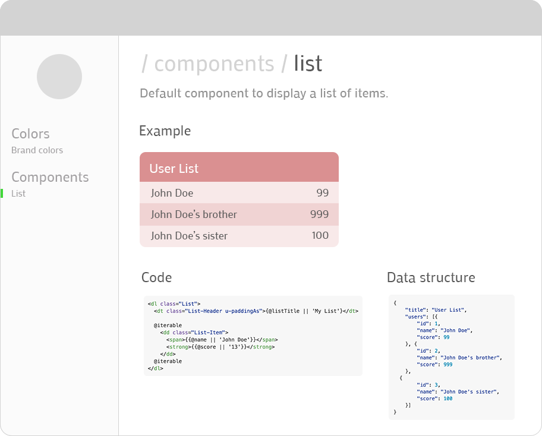

# postcss-style-book
Generate style guide based on your css components as a SPA

## Ideea
**postcss-style-book** aims to be a tool that generates visual style guides for your CSS components, out of your CSS files.

## Example
having a the following css component named **list.css**

```css
:root {
  /*
  ---
  section: Colors
  title: Default brand colors
  ---
  Here should go **relevant** component description.
  */
  
  /* @start color */
  --color-brand: indianred; 
  --color-accent: lime;
  /* @end color */
}

/*
---
section: Components
title: List
data: fakeData-list.json
---
Default component to display a list of items.

<dl class="List">
  <dt class="List-Header u-paddingAs">{@listTitle || 'My List'}</dt>
  
  @iterable
    <dd class="List-Item">
      <span>{{@name || 'John Doe'}}</span>
      <strong>{{@score || '13'}}</strong>
    </dd>
  @iterable
</dl>

*/

.List {
   border-radius: 4px;
   background-color: var(--color-brand);
}

.List-Header {
  font-weight: 700;
}

.List-Item {
  padding:0;
  margin:0;
}

.List-Item:nth-child(even) {
  background-color:rgba(255, 255, 255, .6);
}

.List-Item:nth-child(odd) {
  background-color:rgba(255, 255, 255, .8);
}

/*Utility classes */
.u-paddingAs {
  padding: 4px;
}
```

**fakeData-list.json**

```json
{
	"title": "User List",
	"users": [{
		"id": 1,
		"name": "John Doe",
		"score": 99
	}, {
		"id": 2,
		"name": "John Doe's brother",
		"score": 999
	},
  {
		"id": 3,
		"name": "John Doe's sister",
		"score": 100
	}]
}
```


## Output 
*this should be usefull for both BE and FE programers.*
i intent to generate a *Mithil* based SPA (with routing), something, that visually, will look like this.



## Other tools doing kind of the same work ..

* [styledown](https://github.com/styledown/styledown/tree/master)
* [postcss-styleguide](https://github.com/mdings/postcss-styleguide)  
* [postcss-style-guide](https://github.com/morishitter/postcss-style-guide)
